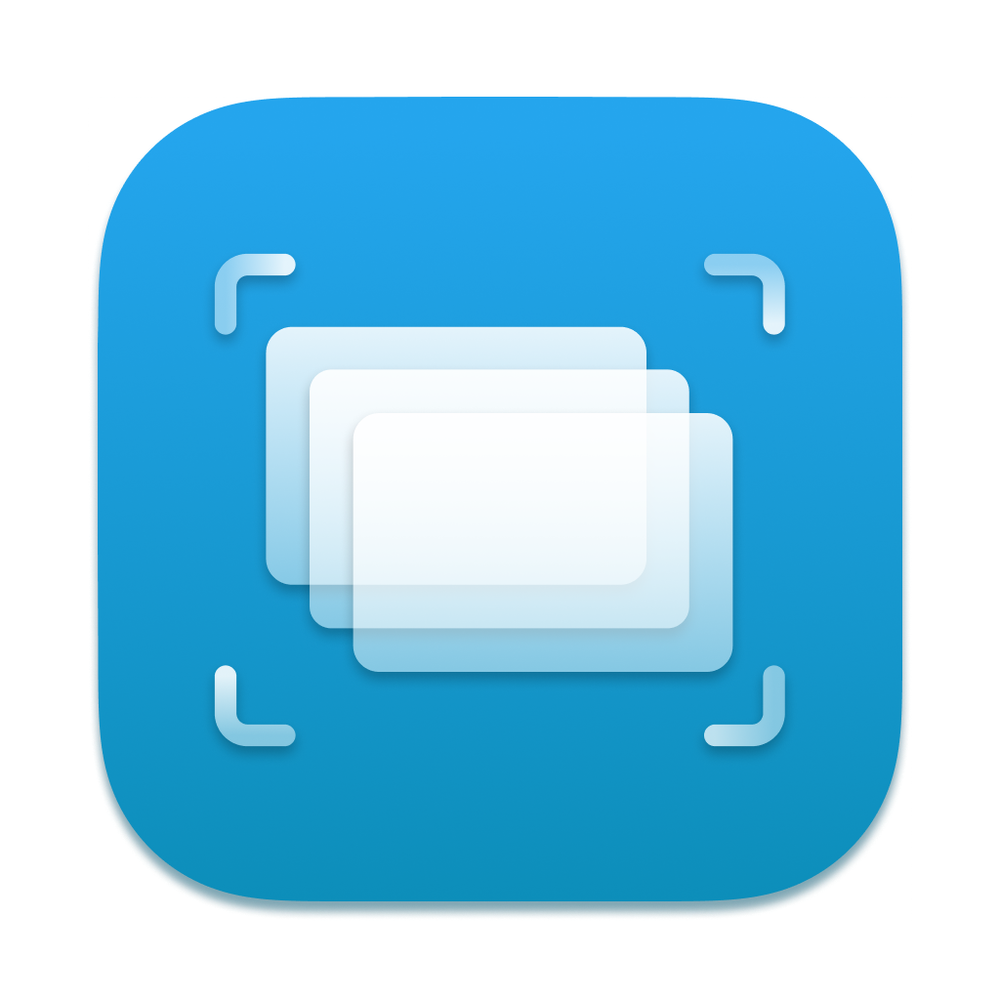

    

# SnapBoard

Simple scanner app for whiteboards that also has folders for organising whiteboards scanned and notetaking features.

Features: 
- Scanning of whiteboards using Vision & VisionKit
- Saving of date created
- Addition of title and description / notes
- Recently scanned whiteboards
- Pinning whiteboards
- Sorting of whitebaords by alphabetical order or date
- Searching of whiteboards
- Tagging of whiteboards for organisation
- QuickLook: Live Text, Translate, Exporting, Mark Up, Copy Subject, etc.

This app was created by Damien Lau Jia Hui, Loh Shao Qi, Christopher Daniel & Fu Yu Wen under the 2022 Swift Accelerator Programme.
